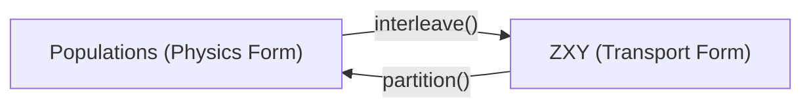

# Data Model

RAN represents events in two distinct forms at opposite ends of the pipeline: the **physics representation** (`Populations`) and the **machine learning transport representation** (`ZXY`).

---

## 1. Physics Representation: `Populations`

`Populations` represents the physical origin of events before training or during evaluation:

- **`mc` (`Events`)**: The simulation, pairing generated particle-level truth `mc.z` with simulated detector response `mc.x` row-by-row.
- **`data` (`EventArray`)**: The observed detector measurement.
- **`truth` (`EventArray`)**: The particle-level answer key (available only in synthetic closure tests).

### The Truth Isolation Boundary

In a real experimental measurement, the particle-level truth does not exist. To prevent networks or baselines from accidentally accessing this answer key:

1. `truth` sits strictly outside `mc`. Any function passed `mc` cannot access `truth`.
2. When truth is unavailable, `truth` is filled with `TRUTH_SENTINEL = -2^15`.
3. The property `populations.has_truth` indicates whether truth is present.
4. Accessing truth requires an explicit call to `populations.require_truth()`, which raises an exception if the sentinel is encountered.

---

## 2. Transport Representation: `ZXY`

`ZXY` represents events formatted for batching and optimization:

- **`z`**: Particle-level features (or sentinels for nature rows).
- **`x`**: Detector-level features.
- **`y`**: Binary domain labels ($y = 1$ for data, $y = 0$ for simulation).

### Representation Conversion

- **`Populations.interleave()`**: Converts physics populations into transport form (data rows first with $y=1$, followed by simulation rows with $y=0$).
- **`ZXY.partition()`**: Partitions batched arrays back into distinct populations.

!!! note "Lossless Conversion"
Converting `Populations` to `ZXY` is lossless. Partitioning `ZXY` back to `Populations` reconstructs the samples, but row ordering from shuffling is discarded.

---

## 3. Sentinels & Gradient Safety

Why is `TRUTH_SENTINEL` defined as `-2^15` instead of `np.nan`?

During training, `z` is passed to the generator $g(z)$. For nature events ($y=1$), the generator's output is masked out:

$$w_i = (1 - y_i) \cdot g(z_i)$$

Under IEEE 754 floating-point arithmetic:

- $0 \times (-2^{15}) = 0.0$ (finite numbers are annihilated).
- $0 \times \text{NaN} = \text{NaN}$ (NaNs propagate).

If `np.nan` were used as the sentinel, NaNs would propagate through the weight normalization sum to every weight in the batch, causing gradients in `jax.grad` to immediately become NaN.

`-2^15` is an ordinary finite number that survives narrowing to float16 and is cleanly annihilated by the mask.
