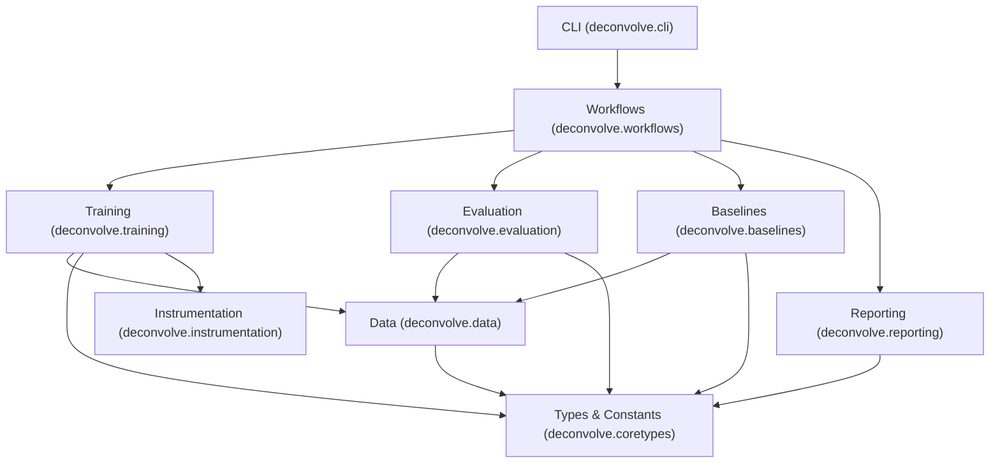

# System Design

Deconvolve is structured by pipeline stage into specialized subpackages with strict, unidirectional dependency constraints.

---

## Package Layout

```shell
src/deconvolve/
├── __init__.py           # Backend bootstrap: pins Keras backend & float32
├── __main__.py           # Module execution entry point
├── cli.py                # Typer CLI definition (defers module imports)
├── config.py             # Configuration parsing & validation
├── coretypes/             # Shared constants, types, enums, event dataclasses
├── data/                 # Datasets, Gaussian generation, Zenodo caching
├── training/             # Keras models, fused JAX training engine, MMD
├── evaluation/           # On-device vectorized metrics & plotting
├── baselines/            # IBU and OmniFold comparison implementations
├── uncertainty/          # Variance decomposition, ANOVA, covariance
├── reporting/            # LaTeX dossier compilation & figure rendering
├── workflows/            # High-level orchestration (train, leakage-check)
└── instrumentation/      # Microsecond phase timers & Rich logging
```

---

## Unidirectional Dependency Rule

Deconvolve strictly enforces a layered dependency hierarchy:



### Key Architectural Invariants

1. **Workflows are the Sole Orchestrator**: `workflows/train.py` and `workflows/leakage.py` import `training` and `evaluation`. Neither `training` nor `evaluation` may ever import `workflows` or each other.
2. **Deferred CLI Imports**: `cli.py` defers importing heavy scientific dependencies (JAX, Keras, matplotlib) until the specific subcommand function is called. This guarantees instantaneous CLI startup for `--help` and shell completion.
3. **No Circular Imports**: Shared data structures, constants, and protocols live in `coretypes/` and are consumed downwards.
