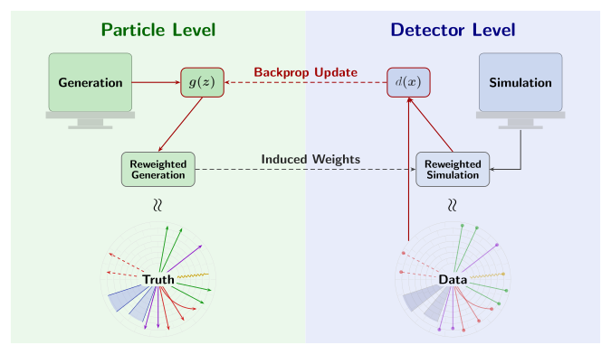

<!-- markdownlint-disable-file no-inline-html list-marker-space -->
# Deconvolve

**Deconvolve** is a machine learning framework for high-energy physics (HEP) that learns continuous per-event weights to correct simulated (Monte Carlo) distributions so they match observed detector data.

Built on **Keras 3** with the **JAX** backend, Deconvolve is engineered end-to-end for performance, mathematical precision, and scalable multidimensional unfolding.

---

## Introduction

In particle physics experiments, Monte Carlo (MC) simulations model physical processes and detector responses. However, simulations never perfectly reproduce observed data due to physics mismodellings and detector effects.

Traditional reweighting schemes bin events in one or two kinematic variables and apply hand-tuned correction factors. This approach degrades rapidly as the dimensionality of the feature space increases.

<figure class="ran-figure" markdown="span">
  { .ran-schematic }
  <figcaption>
    The generator <code>g(z)</code> assigns a weight to each particle-level
    event; those weights are carried to detector level, where the
    discriminator <code>d(x)</code> compares reweighted simulation against
    observed data and backpropagates through the weights.
  </figcaption>
</figure>

Deconvolve solves this problem through a two-player adversarial game:

1. **Generator $g(z)$**: Predicts a continuous per-event weight from particle-level (truth) features $z$, parameterized by a neural network with $\text{softplus}$ activation:

    $$
    w_i = \frac{g(z_i)}{\frac{1}{N}\sum_{j=1}^N g(z_j)}
    $$

2. **Discriminator $d(x)$**: Evaluates detector-level (reconstructed) features $x$, learning to distinguish real observed data ($y = 1$) from reweighted simulation ($y = 0$).

At convergence, the discriminator cannot distinguish reweighted simulation from real data ($d(x) \to 0.5$, loss $\to \log 2$), and the generator's weights yield an optimal, unbinned multi-differential correction.

---

## Features

- **High-Performance JAX Backend**: JIT-compiled training loops, fused gradient steps, and on-device metric evaluations.
- **Strict Float32 Pipeline**: Guaranteed deterministic numerical precision with `HIGHEST` matrix multiplication accuracy and zero silent precision downcasting.
- **MMD Model Selection**: Unbiased Maximum Mean Discrepancy (MMD) with multi-scale Gaussian kernels evaluated on validation splits for robust checkpoint selection.
- **Unfolding Baselines**: Integrated comparison baselines including Iterative Bayesian Unfolding (IBU) and OmniFold (with an isolated TensorFlow worker environment).
- **Automated LaTeX Dossiers**: End-to-end report generation compiling publication-quality summary tables, pull plots, and covariance matrices into standalone LaTeX/PDF documents.

---

## Quick Navigation

-   **[Getting Started](getting-started/installation.md)**

    ---

    Install dependencies using `uv`, configure CUDA, and train
    your first 1D Gaussian model in minutes.

-   **[User Guide](user-guide/cli.md)**

    ---

    Explore the `deconvolve` CLI commands: training, evaluation, automated LaTeX
    reporting, and baseline comparisons.

-   **[Theory & Methodology](theory/reweighting.md)**

    ---

    Delve into the mathematics: the min-max game, MMD model selection, and
    empirical saturation diagnostics.

-   **[API Reference](api/overview.md)**

    ---

    Comprehensive Python API documentation for `deconvolve.training`, `deconvolve.data`,
    `deconvolve.evaluation`, `deconvolve.uncertainty`, and more.

