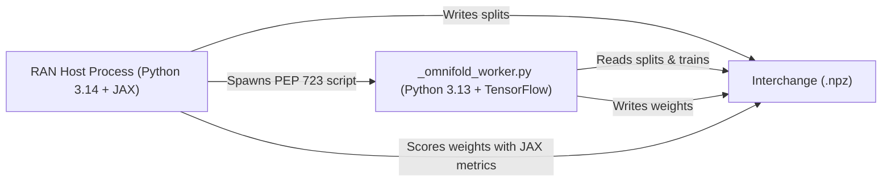

# Comparison Baselines

RAN includes built-in implementations of standard unfolding baselines in High Energy Physics: **Iterative Bayesian Unfolding (IBU)** and **OmniFold**.

---

## Shared Evaluation Protocol

To ensure a fair scientific comparison, baselines in `deconvolve.baselines._shared` adhere to a strict evaluation protocol:

1. **Identical Datasets**: Baselines load the exact same event populations (`fit` and `test` splits) generated for a RAN run.
2. **Train/Val Only for Fitting**: Baselines fit their response models exclusively on `Split.TRAIN | Split.VAL`.
3. **Identical Held-out Evaluation**: The test split is evaluated using the exact same vectorized metrics (`deconvolve.evaluation.evaluate`).

---

## 1. Iterative Bayesian Unfolding (IBU)

Iterative Bayesian Unfolding (also known as D'Agostini unfolding) is a classic binned unfolding method based on Bayes' theorem.

### Implementation Details

- **Module**: `deconvolve.baselines.ibu`
- **Binning**: Automatically determines purity-based binning per variable.
- **Weights**: Converts unfolded bin probabilities back into per-event weights for evaluation.

### Running IBU

```shell
ran baseline ibu --run-dir runs/2026-09-19-164500
```

---

## 2. OmniFold

OmniFold is an unbinned machine learning unfolding algorithm that alternates training two neural network classifiers using full phase-space event information.

### The Isolated Worker Architecture

OmniFold depends on TensorFlow, which cannot coexist in the main Python runtime:

- TensorFlow has no official wheels for the project's Python version floor.
- TensorFlow cannot share a Keras backend with JAX within a single process.

To resolve this, RAN uses an **isolated worker pattern**:



1. **Host (`ran/baselines/omnifold.py`)**: Prepares populations from `config.json`, serializes them to a temporary `.npz` file, and invokes the worker.
2. **Worker (`ran/baselines/_omnifold_worker.py`)**: A standalone PEP 723 script executed via `uv run --isolated --python 3.13` with pinned TensorFlow dependencies.
3. **Scoring**: The worker writes the resulting event weights back to the `.npz` file, and the host evaluates them using RAN's JAX metric pipeline.

### Running OmniFold

```shell
ran baseline omnifold --run-dir runs/2026-09-19-164500
```
